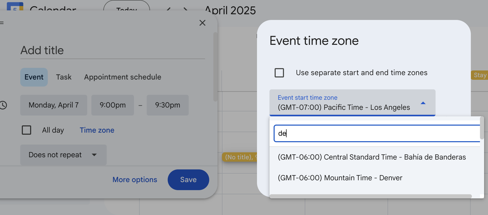

# google-calendar-timezone-search

a small user script to add a search input for google calendar timezone dropdown

## Installation

### Using Tampermonkey

1. Install the Tampermonkey extension for your browser:

- [Chrome](https://chrome.google.com/webstore/detail/tampermonkey/dhdgffkkebhmkfjojejmpbldmpobfkfo)
- [Firefox](https://addons.mozilla.org/en-US/firefox/addon/tampermonkey/)
- [Edge](https://microsoftedge.microsoft.com/addons/detail/tampermonkey/iikmkjmpaadaobahmlepeloendndfphd)
- [Safari](https://apps.apple.com/app/tampermonkey/id1482490089)

2. Click on the Tampermonkey icon in your browser and select "Create a new script"

3. Delete the default template and paste the content of the user script

4. Save the script (File > Save or Ctrl+S)

5. Navigate to Google Calendar and the timezone filter dropdown should now have a search functionality

## Usage

When using Google Calendar's timezone selector, a search input will appear allowing you to quickly filter the available timezones.

